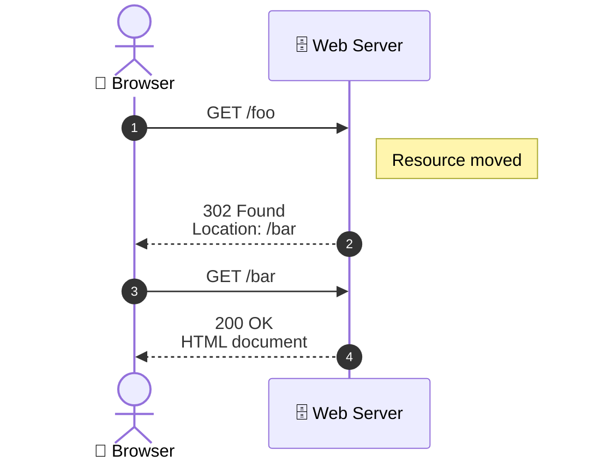

# Regression tests

Simple paragraph with *emphasis* and **alerts**. 

The follow is a subsection header with a specified ID

## Code Blocks {#code_blocks}

Here is a paragraph with some code: `x = a + b` and I wonder how it will render.

1234567890123456789012345678901234567890123456789012345678901234567890 `x = a + b`

## Lists

bullet list

* Simple bullet
* Another bullet

ordered list

1. Simple ordered item
2. Another ordered item

nested lists

* Outer bullet
    * Inner bullet

another nested lists

1. Outer ordered item
    * Inner bullet

## Figures

Not the province of the converter, but here's a model of how to do a figure. Note that the shortdescription
becomes the ALT text. Aim for a description of the picture (for someone who can't see) and keep in short (100-140 characters).

```{=pretext}
<figure>
  <caption>
    The CSS box model. Figure used in accordance with the
    W3Schools fair-use policy.
  </caption>
  <image source="box-model.gif" width="50%">
    <shortdescription>
      The CSS box model consists of four nested regions. 
      From the center outward they are content, padding, border, and margin.
    </shortdescription>
  </image>
</figure>
```

and here's one that adds a longer, more descriptive description. 

```{=pretext}
<figure>
  <caption>
    The CSS box model. Figure used in accordance with the
    W3Schools fair-use policy.
  </caption>
  <image source="box-model.gif" width="50%">
    <shortdescription>
      The CSS box model consists of four nested regions. 
      From the center outward they are content, padding, border, and margin.
    </shortdescription>
    <description>
      <p>
        The diagram consists of four nested rectangular areas. The innermost
        area and largest is the content. Padding surrounds the content, a thin
        green-colored border surrounds
        the padding, and the margin is the outermost area.
      </p>
    </description>
  </image>
</figure>
```

## Xref

See <xref ref="code_blocks"/> to learn about code blocks.

## Mermaid sequence diagrams

Here's a sequence diagram. It has accTitle and addDesc for accessibility.



Or, creating a nice `figure` environment and both a shortdescription (same role as ALT) and
and 

```{=pretext}
<figure xml:id="fig-http-redirect">
  <caption>
    A browser follows an HTTP redirect from <c>/foo</c> to <c>/bar</c>.
  </caption>

  <image>
    <shortdescription>
      Sequence diagram showing a browser following an HTTP redirect
  from /foo to /bar.
    </shortdescription>

    <description>
     <p>
    The diagram has two vertical lifelines, with the browser on the
    left and the web server on the right. Time proceeds downward.
    Four numbered arrows show the interaction. The browser requests
    <c>/foo</c>. The server returns status 302 with a Location header
    naming <c>/bar</c>. The browser then requests <c>/bar</c>, and
    the server returns status 200 with the HTML document.
  </p>
    </description>

    <mermaid label="http-redirect-sequence">
sequenceDiagram
    accTitle: HTTP redirect from /foo to /bar
    accDescr {
      The browser requests /foo. The server responds with status 302
      and a Location header naming /bar. The browser then requests /bar,
      and the server returns the HTML document.
    }

    autonumber
    actor Browser
    participant Server as Web Server

    Browser->>Server: GET /foo
    Note right of Server: Resource moved
    Server-->>Browser: 302 Found<br/>Location: /bar
    Browser->>Server: GET /bar
    Server-->>Browser: 200 OK<br/>HTML document
    </mermaid>
  </image>
</figure>
```


## Live HTML examples

```htmla
<h1>Big Header</h1>

<p>paragraph under the header</p>

<form method="get" action="/cgi-bin/echo.cgi">
<p><label for="name">what is your name?</label>
   <input id="name" name="name" placeholder="Arthur, King of the Britons"></p>

<p><label for="quest">what is your quest?</label>
   <input id="quest" name="quest" placeholder="To seek the Grail"></p>

<button type="submit">submit</button>
</form>
```

## Python Code Examples

Here's a Flask endpoint:

```python
@app.request('/about')
def about():
    '''a simple 'about' page'. '''
    flash('thanks for asking!')
    return render_template('request')
```

## JavaScript Code Examples

Here's some JS code:

```javascript
// not the coding I would suggest, but I wanted to have some
// constants to see how the fontification of keywords went
function pyth(a,b) {
    const a2 = a*a;
    const b2 = b*b;
    return Math.sqrt(a2+b2);
}
```

## Tables

| Attribute            | Why you need it                     |
| -------------------- | ----------------------------------- |
| `request.method`     | Is this a GET or POST?              |
| `request.args`       | GET form/query parameters.          |
| `request.form`       | POST form parameters.               |
| `request.files`      | Uploaded files.                     |
| `request.cookies`    | Read cookies.                       |
| `request.get_json()` | Read JSON requests from JavaScript. |


