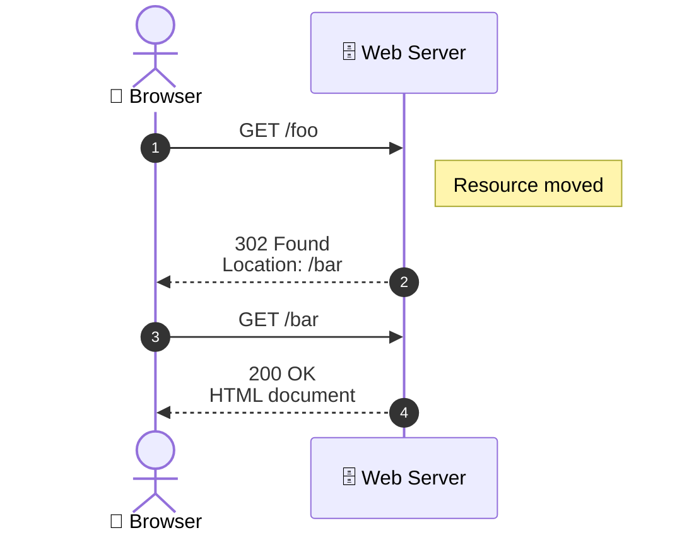

# Redirects and Errors

A web application sometimes needs to *redirect* the user/client. That means to respond
to the client (usually a web browser) with a URL, which the client then dutifully requests
instead of its original request. Essentially, the server is saying "don't ask for /foo, 
request /bar instead". 

So, the journey is like this:

1. Browser requests a url, say `/foo`
1. Server responds saying, "no, GET `/bar` instead"
1. Browser requests `/bar`
1. Servers responds to `/bar`
1. Browser displays that response

Here's a sequence diagram:



This whole sequence of round trips usually takes less than a second
and the user doesn't even notice (though they may notice that the URL
has changed.)


Why would the server do that? Here are a few common reasons:

* After logging in — Redirect the user to their dashboard or the page they originally wanted.
* To simplify URLs — Redirect from an old or alternate URL to a canonical one (e.g., /home → /).
* When a page has moved — Send users and search engines to the new URL.
* To enforce security — Redirect from http:// to https://.
* When access is denied — Redirect unauthenticated users to the login page or unauthorized users to an error page.
* To personalize the experience — Redirect users to a language- or region-specific version of the site.
* After submitting a form — Prevent duplicate submissions if the user refreshes the page (the Post/Redirect/Get pattern).

Let's start with a concrete example of the notion of simplifying a URL. Suppose someone searches a website for some target.
The result is often a page listing those matches, each linking to a specific result. For example, suppose you search IMDB.com
for "Lord of the Rings"; you wouldn't be surprised to get (at least) three results. But now suppose you search for "Fellowship of the Ring," where you might get just one result. But it would be annoying to present the user with a page of one result, when you could send them directly to the result. Let's imagine the following conversation between browser and server:

1. Browser requests IMDB home page: `GET https://www.imdb.com/`
1. Server responds with that home page.
1. User fills out the search form and submits. The browser sends a GET request. 
   The url might look like `GET https://www.imdb.com/find?q=fellowship+of+the+ring`
1. Server responds with a *redirect* to `https://www.imdb.com/title/tt0120737/`
1. The browser immediately sends a GET request to that URL.

(As of this writing, there are several matches at IMDB for that query, so the scenario isn't true. But it's plausible.)

The redirect is typically too fast for the user to notice. 

## Redirects in Flask

Flask makes redirects quite easy. For a slightly different example, suppose there is a endpoint that handles logins. 
On GET, it sends a login form to the browser. On POST, it checks the credentials (username and password). If they are
correct, the user is redirected to the the `/dashboard` endpoint. The code might look like this:

```python
@app.route('/dashboard')
def dashboard_handler():
    user_data = look_up_user_data()
    return render_template('dashboard', data=user_data)

@app.route('/login', methods=['GET', 'POST'])
def login():
  if request.method == 'GET':
    return render_template('login_page')
  elif request.method == 'POST':
    if credentials_ok(request.form['username'], request.form['password']):
        return redirect(url_for('dashboard_handler'))
    else:
        flash('login incorrect; please try again')
        return render_template('login_page')
```

There are a few things to notice about that code. 
First, we explicitly check the `request.method` for the two options,
even though there are only the two options. Second, the argument
to `redirect` is *not* the URL (namely `/dashboard` in this example), but
instead it's the expression `url_for('dashboard_handler')` where the argument 
is the name of the function that is associated with the desired URL. Why does
Flask make us do this Rube Goldberg technique? The answer is that because the URLs 
*generated* by Flask, it means that they can all be changed in a systematic way, 
such as preceding them all with a prefix (which is a very common operation). For
more on `url_for`, see <xref ref="url_for"/>.

## Errors

## Notes on Redirect

* The argument to a `redirect` is a URL, generated by `url_for()`
* The response, including the URL, goes back to the browser, 
* The browser then requests the specified URL
* That URL (presumably) creates the desired response.


The purpose of a redirect is not for coding convenience but because
the second URL is the "right place to be". For example, a login route
(such as `/login/`) might redirect to the user's "home" page, (such as
`/user/fred`). That "right place" might be bookmarked, sent to
someone, etc.

## Notes on Abort

The `abort` function responds to the browser is one of a standard set
of errors, like 404 (not found) or 403 (forbidden). It works, but the
response is pretty minimal. It's often better to flash a nicer error
message and redirect them to a place where they can try again.


<?xml version="1.0"?>
<section xml:id="flask_redirects-and-errors">
  <title>Redirects and Errors</title>
  <p>To redirect a user to another endpoint, use the <c classes="xref py py-func">redirect()</c>
            function; to abort a request early with an error code, use the
            <c classes="xref py py-func">abort()</c> function:</p>
  <pre>from flask import abort, redirect, url_for

@app.route('/')
def index():
    return redirect(url_for('login'))

@app.route('/login')
def login():
    abort(401)
    this_is_never_executed()</pre>
  <p>This is a rather pointless example because a user will be redirected from
            the index to a page they cannot access (401 means access denied) but it
            shows how that works.</p>
  <p>By default a black and white error page is shown for each error code.  If
            you want to customize the error page, you can use the
            <c classes="xref py py-meth">errorhandler()</c> decorator:</p>
  <pre>from flask import render_template

@app.errorhandler(404)
def page_not_found(error):
    return render_template('page_not_found.html'), 404</pre>
  <p>Note the <c>404</c> after the <c classes="xref py py-func">render_template()</c> call.  This
            tells Flask that the status code of that page should be 404 which means
            not found.  By default 200 is assumed which translates to: all went well.</p>
  <p>See <inline classes="xref std std-ref">error-handlers</inline> for more details.</p>
</section>
